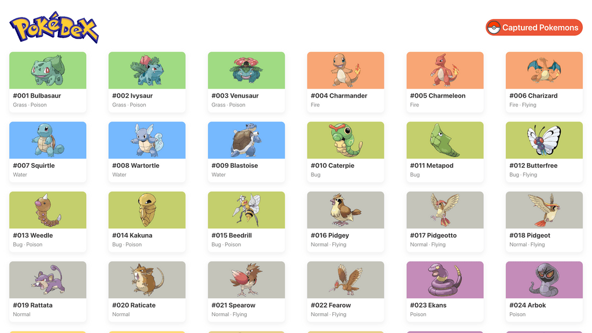
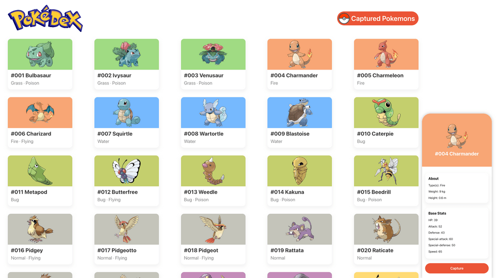
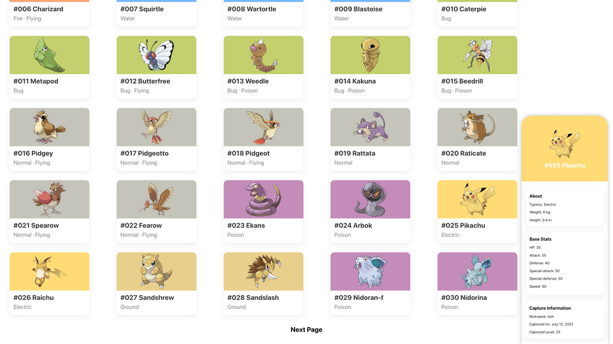
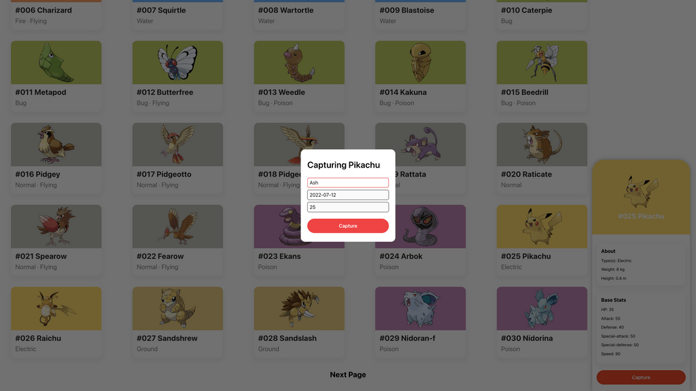
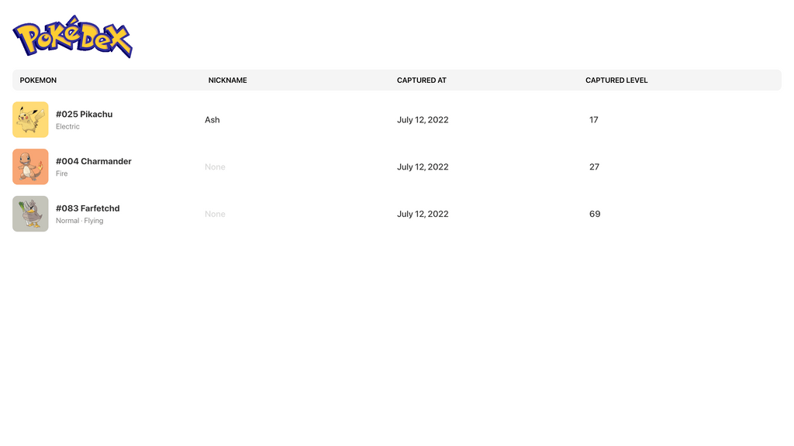

# Pokédex

A Pokédex web application that displays a list of Pokémon in National Pokédex order, utilizing [PokeAPI](https://pokeapi.co/) for data. The user can get more details of the Pokémon, 'capture' the Pokémon to localStorage, and view a list of all of the caught Pokémon. The list of caught Pokémon will display the Pokémon's nickname (if given one), captured date, and captured level. The captured date is generated by using `Date.now()` which is then converted to ISO 8601 `YYYY-MM-DDThh:mm:ssTZD`, and the level is a randomly generated integer between one and one hundred. Bootstrapped with [Create React App](https://github.com/facebook/create-react-app).

## Installation

1. `git clone` this repository to a local directory
2. In your text terminal, `cd` into your the repositorys directory and run `npm i`
3. Then start the application by running `npm start`
4. Your browser will launch the application at [http://localhost:3000/](http://localhost:3000/)
5. The deployed application can be found at [https://jl-pokedex.herokuapp.com/](https://jl-pokedex.herokuapp.com/)

## Screenshots

The homepage displays a list of 30 Pokémon with the Pokémon's name, picture, dex number and type(s).

Clicking on a Pokémon card will bring up a detail card on the right side of the screen. There, you can find more information about the Pokémon's weight, height and stats. There is also a capture button where the user can capture the Pokémon if it has not been previously captured. If the Pokémon is already captured, the details of the captured Pokémon will be shown instead.

Clicking on the capture button will bring up a modal that asks the user for an optional nickname, with a minimum length of one and a maximum length of twelve characters. The capture button is disabled by default and is only enabled after clicking on the 'Nickname' input field, as the date (YYYY-MM-DD) and level will autofill.

The user can then head to the Captured page where all of the caught Pokémon will be displayed. The page displays the Pokémon's name, type(s), nickname (if given, otherwise it will be displayed as 'None'), captured date (Month DD, YYYY), and captured level.

## Technologies

This application is built with:

-   [Node.js](https://nodejs.org/en/docs/) - Back End Runtime Environment
-   [React.js](https://reactjs.org/docs/getting-started.html) - Front End Library
-   [TypeScript](https://www.typescriptlang.org/docs/) - Superset of JavaScript

Dependencies:

-   [axios](https://axios-http.com/docs/intro) - HTTP Client for Node.js
-   [react-router-dom](https://reactrouter.com/docs/en/v6) - Client-side routing
-   [tailwindcss](https://tailwindcss.com/docs/installation) - CSS framework

## License

-   MIT License Copyright (c) 2022 Justin Le
